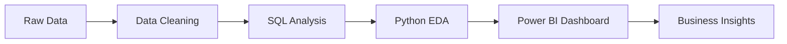

# 🚀 Pavan Rajoli

---

# 💫 About Me

🎯 Aspiring **Data Analyst** passionate about solving real-world business problems using data.

📊 I enjoy:

* Cleaning & transforming datasets
* Building interactive dashboards
* Writing optimized SQL queries
* Performing data analysis
* Creating meaningful business insights

💡 Currently working on:

* Real-world analytics projects
* Power BI dashboard development
* SQL case studies
* Python data analysis

📚 Learning:

* Advanced SQL
* Machine Learning Basics
* Data Storytelling
* Advanced Power BI

---

# ⚡ Tech Arsenal

  

---

# 🧠 Data Analyst Workflow

---

# 🚚 Featured Project

<table>
<tr>
<td width="100%">

# 📦 Cargo Logistics & Delivery Analytics Dashboard

📊 Interactive Power BI dashboard developed to analyze:

* Shipment Tracking
* Delivery Performance
* Operational KPIs
* On-Time Delivery %
* Destination Analysis
* Delay Tracking
* Delivery Efficiency

🛠️ **Tools Used:**
`Power BI` `Excel` `Data Cleaning` `DAX`

📈 **Key Insights:**
✔ Improved visibility of delivery performance
✔ Identified delayed shipment patterns
✔ Tracked operational KPIs effectively
✔ Created area-wise delivery analysis

🔗 Add Your Power BI Project Link Here

</td>
</tr>
</table>

---

# 📊 GitHub Analytics

  

---

# 🏆 GitHub Trophies

---

# 📈 Contribution Graph

---

# 🌐 Connect With Me

---

## 💭 Quote of the Day

### ✨ “Data is the new oil, but insights are the real fuel.”

⭐ From [Pavan Rajoli](https://github.com/YOUR_USERNAME)

